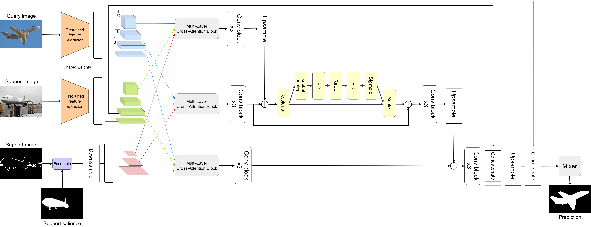

# SaMoCCA: Saliency-guided Model with Cross and Channel Attention for Few-Shot Segmentation

SaMoCCA is a few-shot semantic segmentation model that augments dense cross-attention
mask aggregation with a class-agnostic saliency prior on the support branch and a
channel-attention recalibration step. The binary support mask is fused with a frozen
U^2-Net saliency map, the fused signal guides multi-layer cross-attention between query
and support features, and a Squeeze-and-Excitation block recalibrates the coarse merged
features before the mask-feature mixer produces the final per-pixel prediction.

<p align="middle">
    
</p>

## Architecture overview

- **Shared backbone (frozen):** ResNet-50 / ResNet-101 / Swin-B, with shared weights for
  the query and support images. Multi-scale features are extracted at 1/8, 1/16 and 1/32.
- **Ensemble (saliency + mask fusion):** the support mask `M` and the dense saliency map
  `S` are fused as `M = Conv1x1(norm(S) + M)`, where `norm()` rescales the saliency to
  `[0, 1]`. Saliency is used **only** for the support image, never for the query. The
  fused mask is downsampled into the 1/8, 1/16, 1/32 pyramid.
- **Multi-layer cross-attention (DCAMA blocks):** three scaled dot-product cross-attention
  blocks align query and support features at each scale, guided by the fused mask, each
  followed by a Conv-block-x3 for refinement.
- **Channel recalibration (SE):** a Squeeze-and-Excitation block
  (Global pooling -> FC -> ReLU -> FC -> Sigmoid -> Scale, applied as a residual) recalibrates
  the coarse merge branch before upsampling.
- **Mask-Feature Mixer:** the attention branches are merged with high-resolution skip
  connections (1/8 and 1/4) and progressively upsampled (1/4 -> 1/2 -> 1) through three
  mixer blocks to produce the 2-channel (foreground/background) prediction.

## Requirements

- Python 3.7+
- PyTorch 1.13.1 (cu117) and torchvision
- tensorboardX
- numpy, Pillow

Conda environment settings:

```bash
conda create -n SaMoCCA python=3.8
conda activate SaMoCCA

conda install pytorch==1.13.1 torchvision pytorch-cuda=11.7 -c pytorch -c nvidia
pip install tensorboardX numpy pillow
```

## Prepare Datasets

Download COCO2014 train/val images and annotations:

```bash
wget http://images.cocodataset.org/zips/train2014.zip
wget http://images.cocodataset.org/zips/val2014.zip
wget http://images.cocodataset.org/annotations/annotations_trainval2014.zip
```

Download COCO2014 train/val annotations from Google Drive: [[train2014.zip](https://drive.google.com/file/d/1fcwqp0eQ_Ngf-8ZE73EsHKP8ZLfORdWR/view?usp=sharing)], [[val2014.zip](https://drive.google.com/file/d/16IJeYqt9oHbqnSI9m2nTXcxQWNXCfiGb/view?usp=sharing)] (and locate both train2014/ and val2014/ under the annotations/ directory).

Create a directory 'datasets' and place the data to obtain the following structure:

    datasets/
        ├── COCO2014/
        │   ├── annotations/
        │   │   ├── train2014/  # (dir.) training masks (from Google Drive)
        │   │   ├── val2014/    # (dir.) validation masks (from Google Drive)
        │   │   └── ..some json files..
        │   ├── train2014/
        │   ├── val2014/
        │   └── saliency/       # (dir.) generated U^2-Net saliency (see below)
        ├── VOC2012/
        │   ├── JPEGImages/
        │   ├── SegmentationClassAug/
        │   └── U2net_pascalAug/  # (dir.) PASCAL saliency (already provided)
        └── FSS-1000/
            └── <class>/          # images, masks and *_saliency.png

## Prepare backbones

Download the following pre-trained backbones and place them under a `backbones/` directory:

> 1. [ResNet-50](https://github.com/rwightman/pytorch-image-models/releases/download/v0.1-rsb-weights/resnet50_a1h-35c100f8.pth) pretrained on ImageNet-1K by [TIMM](https://github.com/rwightman/pytorch-image-models)
> 2. [ResNet-101](https://github.com/rwightman/pytorch-image-models/releases/download/v0.1-rsb-weights/resnet101_a1h-36d3f2aa.pth) pretrained on ImageNet-1K by [TIMM](https://github.com/rwightman/pytorch-image-models)
> 3. [Swin-B](https://github.com/SwinTransformer/storage/releases/download/v1.0.0/swin_base_patch4_window12_384_22kto1k.pth) pretrained on ImageNet by [Swin-Transformer](https://github.com/microsoft/Swin-Transformer)
> 4. [U^2-Net (`u2net.pth`)](https://github.com/xuebinqin/U-2-Net) for offline saliency generation

The overall directory structure should look like this:

    ../                         # parent directory
    ├── SaMoCCA/                # current (project) directory
    │   ├── common/             # (dir.) helper functions
    │   ├── data/               # (dir.) dataloaders and splits for each FSS dataset
    │   ├── model/              # (dir.) implementation of SaMoCCA (incl. base/u2net.py)
    │   ├── tools/              # (dir.) offline saliency generation
    │   ├── scripts/            # (dir.) scripts for training and testing
    │   ├── README.md           # instructions for reproduction
    │   ├── train.py            # code for training
    │   └── test.py             # code for testing
    ├── datasets/               # (dir.) Few-Shot Segmentation datasets
    └── backbones/              # (dir.) pre-trained backbones (incl. u2net.pth)

## Generate saliency maps

SaMoCCA uses dense, class-agnostic saliency maps generated **offline** by a frozen
U^2-Net for the support branch. PASCAL maps are already provided under
`datasets/VOC2012/U2net_pascalAug/`; for COCO and FSS, generate them once with:

```bash
# COCO  -> datasets/COCO2014/saliency/<train2014|val2014>/<name>.png
python tools/gen_saliency.py --benchmark coco --datapath ../datasets --u2net ../backbones/u2net.pth

# FSS   -> datasets/FSS-1000/<class>/<id>_saliency.png
python tools/gen_saliency.py --benchmark fss  --datapath ../datasets --u2net ../backbones/u2net.pth

# PASCAL (optional, to regenerate) -> datasets/VOC2012/U2net_pascalAug/<name>.png
python tools/gen_saliency.py --benchmark pascal --datapath ../datasets --u2net ../backbones/u2net.pth
```

The script skips images whose saliency already exists (use `--overwrite` to force
regeneration). Generation for COCO is compute-heavy but runs only once and is cached to disk.

## Train and Test

You can adapt the provided scripts to build your own configurations. For more options,
see `./common/config.py`.

> ```bash
> sh ./scripts/train.sh
> ```
>
> - For each experiment, a directory logging the training progress is created under `logs/`.
> - From a terminal, run `tensorboard --logdir logs/` to monitor training.
> - Choose the best model when the validation (mIoU) curve starts to saturate.

For testing, prepare a trained model checkpoint (train your own):

> ```bash
> sh ./scripts/test.sh
> ```

### Saliency toggle

Saliency fusion is enabled by default. To train/test with the support mask only
(no saliency), pass `--no_saliency`:

```bash
python ./train.py ... --no_saliency
```

### Note on checkpoints

Checkpoints are loaded with `strict=True`. Because SaMoCCA adds the `Ensemble` module and
relocates the Squeeze-and-Excitation block, checkpoints trained with the original DCAMA
model are not compatible and must be retrained.

## Acknowledgements

SaMoCCA builds on the DCAMA architecture for dense cross-query-and-support attention, and
uses U^2-Net to produce the class-agnostic saliency prior on the support branch.

```
@inproceedings{shi2022dense,
  title={Dense Cross-Query-and-Support Attention Weighted Mask Aggregation for Few-Shot Segmentation},
  author={Shi, Xinyu and Wei, Dong and Zhang, Yu and Lu, Donghuan and Ning, Munan and Chen, Jiashun and Ma, Kai and Zheng, Yefeng},
  booktitle={European Conference on Computer Vision},
  pages={151--168},
  year={2022},
  organization={Springer}
}

@article{qin2020u2,
  title={U2-Net: Going deeper with nested U-structure for salient object detection},
  author={Qin, Xuebin and Zhang, Zichen and Huang, Chenyang and Dehghan, Masood and Zaiane, Osmar R and Jagersand, Martin},
  journal={Pattern Recognition},
  volume={106},
  pages={107404},
  year={2020},
  publisher={Elsevier}
}
```
